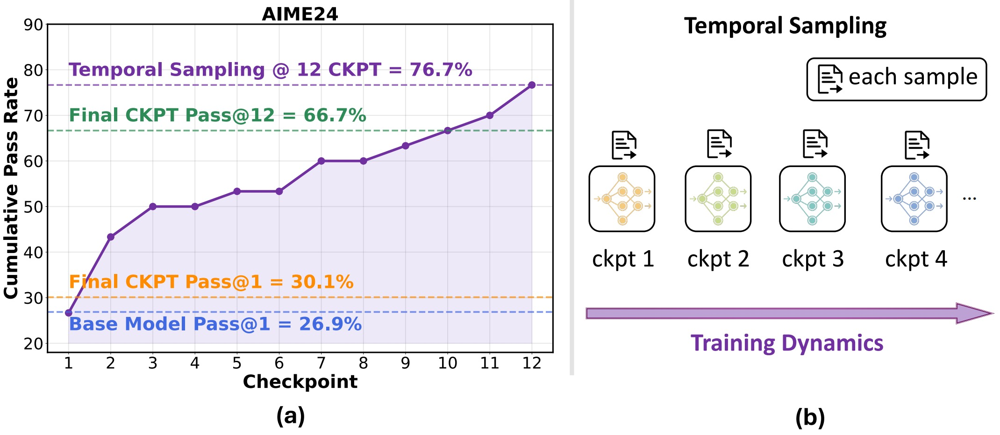
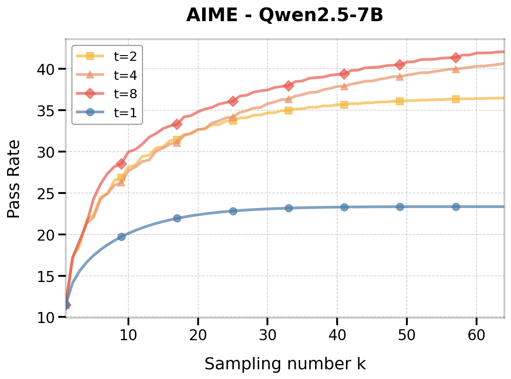

# Temporal Forgetting

This is the official repository for "[Temporal Sampling for Forgotten Reasoning in LLMs](https://arxiv.org/pdf/2505.20196)".

[](https://arxiv.org/pdf/2505.20196) [](https://opensource.org/licenses/MIT)

<!-- **🌟 Update**:  -->

## Abstract

Fine-tuning large language models (LLMs) is intended to improve their reasoning capabilities, yet we uncover a counterintuitive effect: models often forget how to solve problems they previously answered correctly during training. We term this phenomenon **temporal forgetting** and show that it is widespread across model sizes, fine-tuning methods (both Reinforcement Learning and Supervised Fine-Tuning), and multiple reasoning benchmarks. 

To address this gap, we introduce **Temporal Sampling**, a simple decoding strategy that draws outputs from multiple checkpoints along the training trajectory. This approach recovers forgotten solutions without retraining or ensembling, and leads to substantial improvements in reasoning performance, with gains from 4 to 19 points in Pass@k and consistent gains in Majority@k across several benchmarks. We further extend our method to LoRA-adapted models, demonstrating that storing only adapter weights across checkpoints achieves similar benefits with minimal storage cost. 

By leveraging the temporal diversity inherent in training, Temporal Sampling offers a practical, compute-efficient way to surface hidden reasoning ability and rethink how we evaluate LLMs.

## Overview




## Getting Started

**Get Code**
```
git clone https://github.com/uw-nsl/Temporal_Forgetting
```


## Training Checkpoints


We have released our RL training checkpoints of the Qwen2.5-7B model on [Hugging Face](https://huggingface.co/UWNSL). The model is trained on 4k randomly selected samples from the [DeepScaleR dataset](https://huggingface.co/datasets/agentica-org/DeepScaleR-Preview-Dataset). We follow the training hyperparameters of [DeepScaleR](https://github.com/agentica-project/rllm). We save 8 checkpoints with intervals of 32 steps. The training was conducted using the [VERL](https://github.com/volcengine/verl) framework.


## Temporal Sampling

We implement Temporal Sampling in an offline way. We decouple the pipeline by first sampling 64 responses from different checkpoints, then computing Pass@k, Majority Voting, and Best-of-N with Temporal Sampling under various sampling quotas.


### Sampling Responses Data

For your convenience, we have provided the 64 sampling responses of each checkpoint for AIME24, AIME25, and AMC in `sample_64_responses.zip`. To extract:

```bash
cd Temporal_Forgetting
unzip sample_64_responses.zip
```

Each folder contains:
- `samples_{task}`: All questions and complete model responses
- `model_final_answer_{task}`: Extracted model final answers with correctness judgments  
- `QwenReward_{task}`: ORM and PRM scores from Qwen/Qwen2.5-Math-PRM-7B and Qwen/Qwen2.5-Math-PRM-72B
  - ORM: Calculated by the last step score
  - PRM: Average score for all steps


### Inference On Other Tasks

You can also evaluate the models on other tasks by yourself~ We use [lm-evaluation-harness](https://github.com/EleutherAI/lm-evaluation-harness) to generate model responses during inference time.

**Environment Setup**

```bash
cd lm-evaluation-harness
conda create -n lm_eval python=3.10
conda activate lm_eval
pip install -e .
pip install vllm==0.6.5
```

**Available Tasks**

- AIME24
- AIME25
- AMC  
- Olympiad  
- hendrycks_math_500

> **Note**: To generate different numbers of samples, modify the `repeats` parameter in `lm-evaluation-harness/lm_eval/tasks/{task_name}/{task_name}.yaml`. The default sampling number is set to 64.

**Answer Judgement**

We found that rule-based matching has many edge cases and failure instances (for MATH-500 and Olympiad). Therefore, our scoring process includes two steps:

1. **Initial rule-based matching**
2. **LLM-based verification**: For any incorrect results from rule-based matching, we use `Qwen2.5-32B-Instruct` to directly compare the model-generated answer in `\boxed{}` with the ground truth final answer.

> **Note**: `Qwen2.5-7B-Instruct` as a judge may still have limitations in some cases for MATH-500 and Olympiad.

**Scoring Results**

Execute the following command to score the evaluation results:

```bash
python math_metric_llm_eval_general.py --directory_path ${output_path}/${SANITIZED_MODEL_SAVE_LABEL} --task ${task}
```

You can check `llm_answer_result_check_{task_name}` to see the correctness of different sampling responses for each question.

**Complete Evaluation Script**

```bash
#!/bin/bash

# Model configurations
models=(
    "UWNSL/Qwen2.5-7B-deepscaler_4k_step_32"
    "UWNSL/Qwen2.5-7B-deepscaler_4k_step_64"
    "UWNSL/Qwen2.5-7B-deepscaler_4k_step_96"
    "UWNSL/Qwen2.5-7B-deepscaler_4k_step_128"
    "UWNSL/Qwen2.5-7B-deepscaler_4k_step_160"
    "UWNSL/Qwen2.5-7B-deepscaler_4k_step_192"
    "UWNSL/Qwen2.5-7B-deepscaler_4k_step_224"
    "UWNSL/Qwen2.5-7B-deepscaler_4k_step_256"
    "Qwen/Qwen2.5-7B"
)

# Task configurations
tasks=("AIME24" "AIME25" "AMC")

# Model parameters
max_model_tokens=16000
max_gen_tokens=16000
model_args="tensor_parallel_size=1,data_parallel_size=4,gpu_memory_utilization=0.8,max_model_len=$max_model_tokens,dtype=bfloat16"
output_path="Sampling_Results"
batch_size="auto"

# Main evaluation loop
for task in "${tasks[@]}"; do
    for model in "${models[@]}"; do
        # Sanitize model name for file paths
        SANITIZED_MODEL_SAVE_LABEL=$(echo ${model} | sed 's/\//__/g')
        SAMPLE_FILE="${output_path}/${SANITIZED_MODEL_SAVE_LABEL}/samples_${task}_"*".jsonl"
        
        # Check if results already exist
        if ls $SAMPLE_FILE 2>/dev/null; then
            echo "Results already exist for: $model - $task"
            continue
        fi    

        echo "Running evaluation for model: $model, task: $task"
        
        # Run lm-evaluation-harness
        lm_eval --model vllm \
            --model_args pretrained="$model",$model_args \
            --gen_kwargs do_sample=True,temperature=0.6,top_p=0.95,max_gen_toks=$max_gen_tokens\
            --tasks "$task" \
            --batch_size "$batch_size" \
            --log_samples \
            --trust_remote_code \
            --output_path "$output_path" \
            --apply_chat_template
       
        # Score the results
        echo "Scoring results for: ${SANITIZED_MODEL_SAVE_LABEL}"
        python math_metric_llm_eval_general.py \
            --directory_path ${output_path}/${SANITIZED_MODEL_SAVE_LABEL} \
            --task ${task}
    done
done
```


### Inference-time Scaling with Temporal Sampling

To reproduce our results with Temporal Sampling, follow the instructions in the notebooks:

**Pass@k**
- See `Temporal_sampling/calculate_pass_at_k.ipynb`

**Majority Voting**
- See `Temporal_sampling/calculate_Majority_Voting.ipynb`

**Best-of-N**
- See `Temporal_sampling/calculate_BoN.ipynb`

The notebooks will generate visualization results similar to:



We welcome any questions or feedback! 🚀


---

## Acknowledgements

This repository is built upon [lm-evaluation-harness](https://github.com/EleutherAI/lm-evaluation-harness). We would like to thank all contributors for their support.

---


## Citation
```
@article{li2025temporal,
  title={Temporal Sampling for Forgotten Reasoning in LLMs},
  author={Li, Yuetai and Xu, Zhangchen and Jiang, Fengqing and Ramasubramanian, Bhaskar and Niu, Luyao and Lin, Bill Yuchen and Yue, Xiang and Poovendran, Radha},
  journal={arXiv preprint arXiv:2505.20196},
  year={2025}
}
```